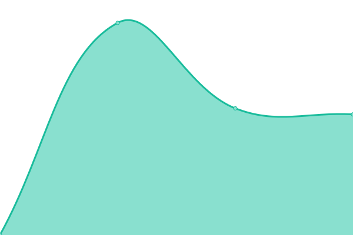
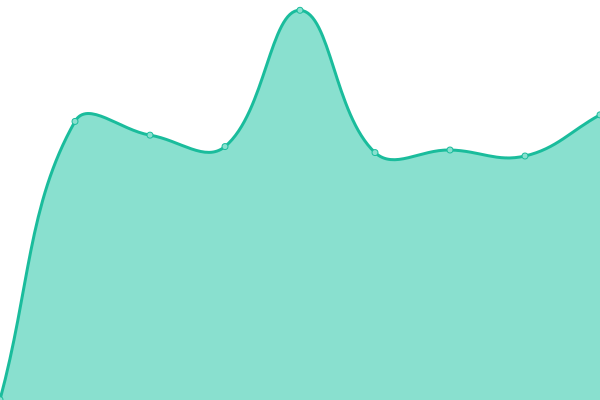
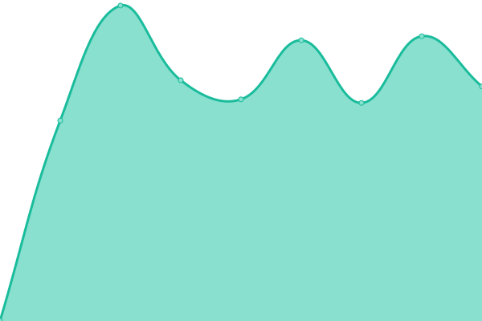

# [📈 Live Status](https://status.thisistak.me): <!--live status--> **🟥 Complete outage**

This repository contains the open-source uptime monitor and status page for [Kyungmo Tak](https://status.thisistak.me), powered by [Upptime](https://github.com/upptime/upptime).

With [Upptime](https://upptime.js.org), you can get your own unlimited and free uptime monitor and status page, powered entirely by a GitHub repository. We use [Issues](https://github.com/xkrrudah/status-website/issues) as incident reports, [Actions](https://github.com/xkrrudah/status-website/actions) as uptime monitors, and [Pages](https://status.thisistak.me) for the status page.

<!--start: status pages-->
<!-- This summary is generated by Upptime (https://github.com/upptime/upptime) -->
<!-- Do not edit this manually, your changes will be overwritten -->
<!-- prettier-ignore -->
| URL | Status | History | Response Time | Uptime |
| --- | ------ | ------- | ------------- | ------ |
|  [cms](https://cms.thisistak.me) | 🟥 Down | [cms.yml](https://github.com/xkrrudah/status-website/commits/HEAD/history/cms.yml) | 

 1171ms
     
 | 

<a href="https://status.thisistak.me/history/cms">74.73%</a>
    

|  [ems](https://ems.thisistak.me) | 🟥 Down | [ems.yml](https://github.com/xkrrudah/status-website/commits/HEAD/history/ems.yml) | 

 1062ms
     
 | 

<a href="https://status.thisistak.me/history/ems">73.72%</a>
    

|  [git](https://git.thisistak.me) | 🟥 Down | [git.yml](https://github.com/xkrrudah/status-website/commits/HEAD/history/git.yml) | 

 981ms
     
 | 

<a href="https://status.thisistak.me/history/git">74.74%</a>
    

|  [mail-server](https://mail.thisistak.me) | 🟥 Down | [mail-server.yml](https://github.com/xkrrudah/status-website/commits/HEAD/history/mail-server.yml) | 

 0ms
     
 | 

<a href="https://status.thisistak.me/history/mail-server">0.00%</a>
    

|  [blog](https://blog.thisistak.me) | 🟥 Down | [blog.yml](https://github.com/xkrrudah/status-website/commits/HEAD/history/blog.yml) | 

 1374ms
     
 | 

<a href="https://status.thisistak.me/history/blog">73.74%</a>
    

|  [chat](https://chat.thisistak.me) | 🟥 Down | [chat.yml](https://github.com/xkrrudah/status-website/commits/HEAD/history/chat.yml) | 

 1099ms
     
 | 

<a href="https://status.thisistak.me/history/chat">73.74%</a>
    

|  [nas](https://nas.thisistak.me) | 🟥 Down | [nas.yml](https://github.com/xkrrudah/status-website/commits/HEAD/history/nas.yml) | 

 1064ms
     
 | 

<a href="https://status.thisistak.me/history/nas">73.75%</a>
    

|  [router](https://router.thisistak.me) | 🟥 Down | [router.yml](https://github.com/xkrrudah/status-website/commits/HEAD/history/router.yml) | 

 1236ms
     
 | 

<a href="https://status.thisistak.me/history/router">73.75%</a>
    

<!--end: status pages-->

[**Visit our status website →**](https://status.thisistak.me)

## 📄 License

- Powered by: [Upptime](https://github.com/upptime/upptime)
- Code: [MIT](./LICENSE) © [Anand Chowdhary](https://anandchowdhary.com), supported by [Pabio](https://pabio.com)
- Data in the `./history` directory: [Open Database License](https://opendatacommons.org/licenses/odbl/1-0/)
